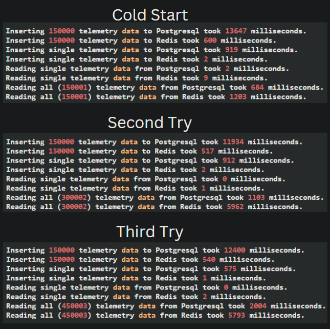

# Performance Workshop | Database vs In-Memory
This repository hosts the source code used in a hands-on workshop that highlighted the performance difference between a RAM-based datastore (Redis) and a disk-based datastore (PostgreSQL). The workshop aimed to equip interns with a practical understanding of how the choice of datastore can significantly impact application performance.

# Overview
During the workshop, under my guidance, the interns developed a simple .NET Core Web API application. The application performed write and read operations using both Redis and PostgreSQL, providing a tangible demonstration of the performance advantages inherent to in-memory databases like Redis compared to disk-based relational databases like PostgreSQL. We utilized electric scooter telemetry data from one of our projects, populated with bogus data using a fake data generator library.

# Results

Please note, the operations were performed on a Huawei Matebook D16 i7-12700H with 16GB RAM. All three components (Web API, PostgreSQL, Redis) were running locally in Docker containers alongside numerous open browser tabs and Visual Studio.