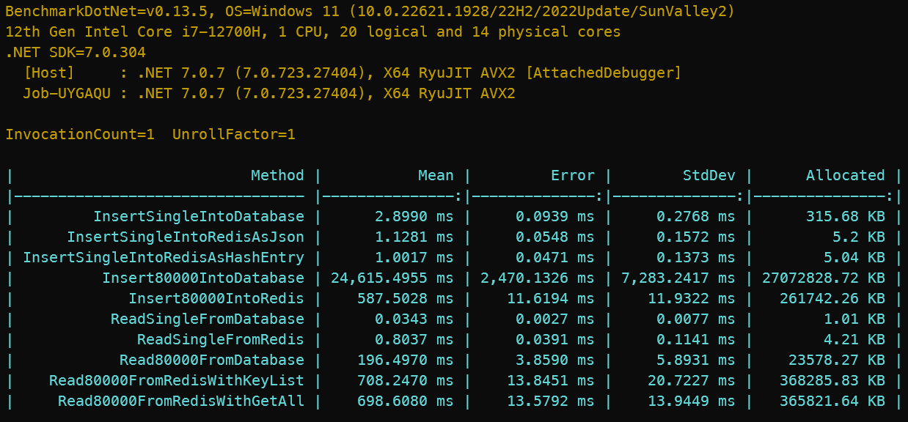

# Performance Workshop | Database vs In-Memory
This repository contains the source code used in a hands-on workshop that illuminated the performance differences between a RAM-based datastore (Redis) and a disk-based datastore (PostgreSQL). The objective of the workshop was to provide interns with a practical understanding of how the choice of datastore can substantially impact application performance.

# Overview
Under my guidance, the interns created a simple .NET Core Web API application during the workshop. This application conducted both write and read operations using both Redis and PostgreSQL, showcasing a clear illustration of the inherent performance advantages of in-memory databases like Redis compared to disk-based relational databases like PostgreSQL. For this exercise, we utilized electric scooter telemetry data from one of our projects, filled with bogus data using a fake data generator library.

Importantly, this comparison is not merely a Redis vs. PostgreSQL benchmark. The Redis related becnhmark methods incorporate the processes of serialization and deserialization as well. This approach provides a more realistic scenario: we're not only comparing the databases but also how these databases would operate in a real-world application where data is commonly manipulated as classes.

# Results
We replaced the original Stopwatch mechanism used for measuring performance with the more accurate and robust BenchmarkDotNet library. This change produced more reliable and statistically significant measurements. Below are the results of the performance comparison:

Please note, these operations were carried out on a Huawei Matebook D16 i7-12700H with 16GB RAM. All three components (Web API, PostgreSQL, Redis) were running locally in Docker containers, alongside several open browser tabs and Visual Studio.

# Conclusion
These results indicate that the choice of datastore plays a significant role in application performance. In-memory databases like Redis can offer faster read and write speeds due to their reliance on memory, unlike disk-based databases like PostgreSQL. However, it doesn't imply that in-memory databases are always the superior choice. It's vital to consider your application's specific requirements and constraints when choosing a database, such as the need for complex queries, data durability, and persistence requirements. Additionally, it's crucial to account for data handling operations such as serialization and deserialization that can affect performance in a real-world application scenario.